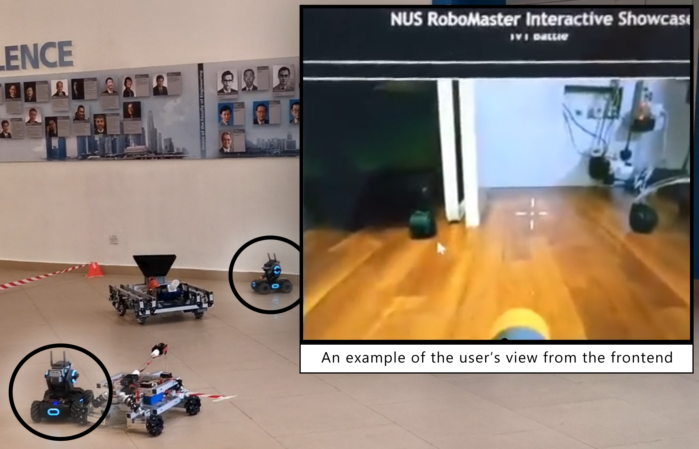

# WebRTC-Enabled RoboMaster S1

## Overview of Project
This repository is part of the **Online Robot Remote Control** project where users can log in to a website to remotely control one of any number of robots in a fleet from the comfort of their homes using WebRTC. 

    

This particular repository contains various Python scripts to hook into a reverse-engineered RoboMaster Unity app which allows for image data from a connected S1 to be pulled and sent over a WebRTC connection to a frontend instance. In addition, it uses pyautogui to send commands received from a WebRTC data stream to the Unity app to control the RoboMaster S1 robot.

### Other Repositories
- [Frontend](https://github.com/nusrobomaster/NUS_RoboMaster_Interactive_Showcase)
- [Signalling Server](https://github.com/nusrobomaster/NUS_RoboMaster_Signalling_Server)

## Files Included
#### `robot.py`
- The main script that uses aioRTC for Python to interface with the Signalling Server and a connected frontend interface. This script also sets up a stream for the frames "sniffed" from the RoboMaster Unity app. 
#### `back_button.jpg`
- An image referenced by pyautogui to locate the RoboMaster Unity app window on a screen. This allows our scripts to bring the window into focus, therby allowing the sending of keypresses via pyautogui.
#### `arena_cam.py`
- Similar to `robot.py`, this script sets up a standard webcam as a WebRTC stream so that users waiting in queue do not get bored while waiting for their turn and have something to observe. This script starts up new WebRTC streams to individual users whenever a new user joins a queue.
#### `pyautogui_test.py`
- A test script that locates the RoboMaster Unity app and sends keypresses to it.
#### `sniffer.py`
- A test script to pull image data from the reverse-engineered RoboMaster Unity app using ZMQ.
#### `blower.py`
- The existence of a sniffer implies that of a blower. This is a deprecated test script that was an attempt to inject keypress data directly into the Unity app without the need of pyautogui. However, for certain reasons this method does not work due to the implementation of sending commands within the Unity app.
#### `RoboMaster App Files/`
- A folder containing the modified build of the RoboMaster app which should replace the contents of the `RoboMaster_Data` folder in a stock version of the Unity app.

*TODO: Rest of the documentation...*

## Appendix
- [Instructions for turning RM App into debug build](https://forum.dji.com/forum.php?mod=viewthread&tid=202649)

